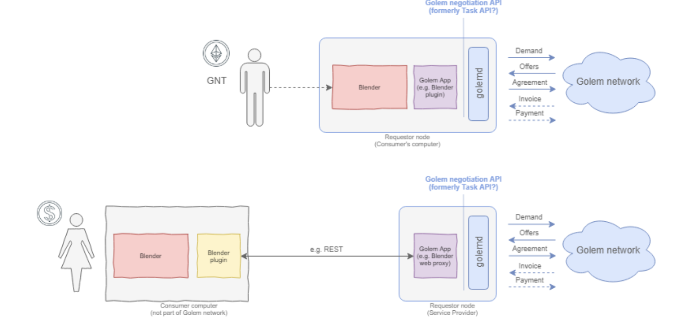
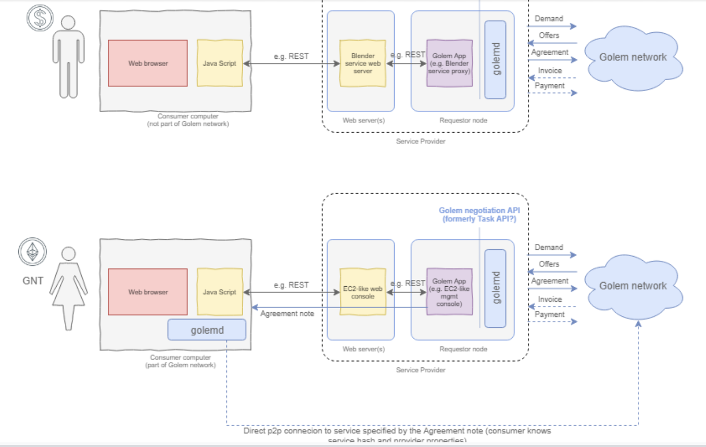
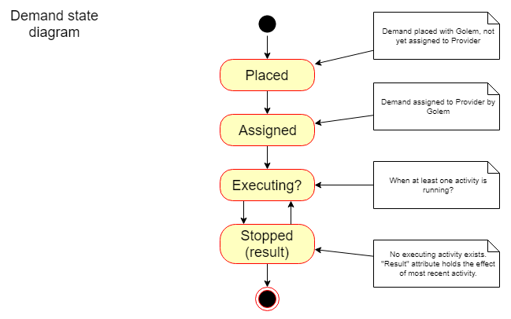
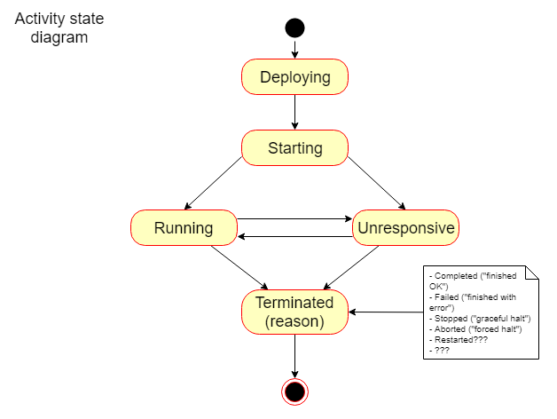
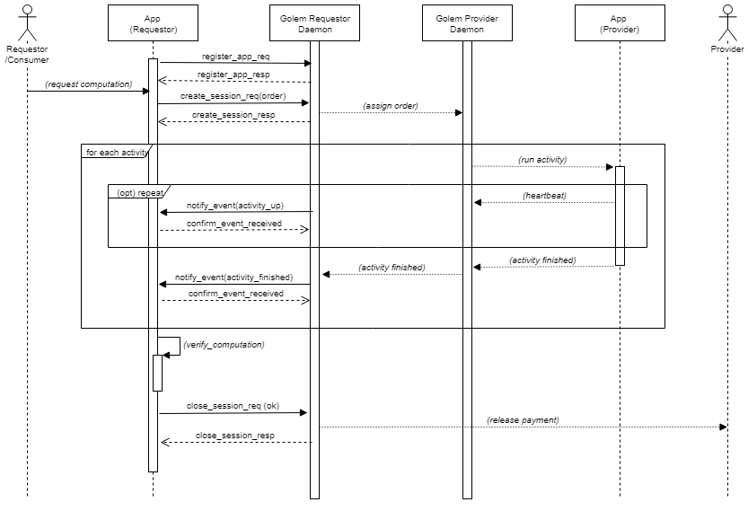
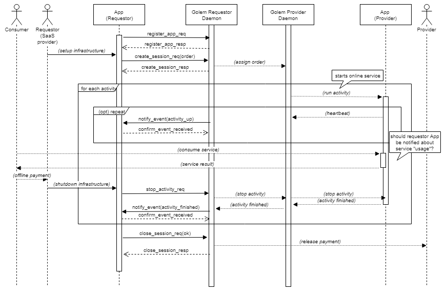
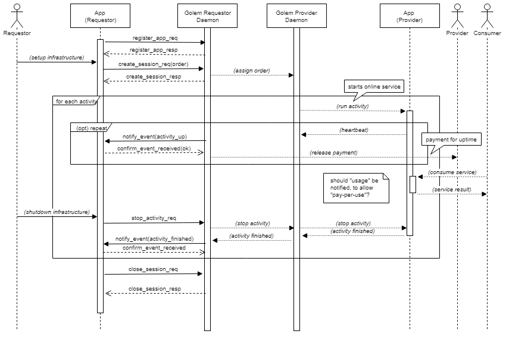

# Golem App API - discussions

## 1. Intro

## 2. High Level Architecture

### 2.1. Golem Components

#### 2.1.1. Golem Node

**2.1.1.1. Golem Requestor Daemon**

**2.1.1.2. Golem Requestor UI**

**2.1.1.3. Golem Provider Daemon**

**2.1.1.4. Golem Provider UI**

#### 2.1.2. Golem p2p network

#### 2.1.3. App Registry \(“Store”\)

### 2.2. Service/Application Components

#### 2.2.1. Service

**2.2.1.1. Service Descriptor**

#### 2.2.2. Requestor Application Models

A Requestor Application is app-specific code that is running on the Golem Requestor side. It is responsible for:

* Composing service Demands to be sent into Golem Network via the Golem Requestor Daemon
* ...what else???

A Requestor Application may include some app-specific UIs, control panels, data input interfaces, etc. From Golem perspective, the purpose of the Requestor Application is to provide a facade over the complexities of Demand&Offer specification, selection of best Offers, etc. **This is where the Requestor User’s UX comes into play.**

Golem ecosystem shall support different designs of Requestor-side Applications. A selection of possible models are considered below for illustration.

**2.2.2.1. Model 1**

**2.2.2.2. Model 2**

**2.2.2.3. Model 3**

#### 2.2.3. Provider Application Models

**2.2.3.1. Implementation**

See [Plugins]() section in [Provider Metamodel]() below

## 3. Golem APIs Model

### 3.1. API Structure

### 3.2. Provider Metamodel

This section indicates logical implementation-level responsibility areas and relevant components of a sample generic Provider Daemon implementation. Note this is an example of a possible implementation, but it is not an exclusive specification of a Golem Provider Daemon.

The intent of this meta-model is to indicate modular breakdown structure, and illustrate how Golem Provider implementation can be decomposed and how individual modules can be built, upgraded and replaced in isolation as long as they implement their respective interfaces.

This modular breakdown is crucial in order to plot Golem’s evolution path. The evolution can be managed by designing and building subsequent versions of the individual modules, roadmaps can be planned by composing a matrix of features implemented in particular modules, etc.

#### 3.2.1. Component Diagram

#### 3.2.2. Components

**3.2.2.1. Net API**

Bottom layer of network communication. See specification of this layer [here]().

**3.2.2.2. Market API**

A layer which offers elementary operations related to acquiring Demands and dispatching Offers. This layer is also responsible for negotiation and Agreement handling aspects of Provider’s behaviour.

Note that a corresponding Contract API logic must exist on Requestor side, though the behaviour of that module is not symmetric to Provider side.

See specification of this layer [here]().

**Question:** Market API is the gateway into Matching mechanism. There can be multiple Matching mechanisms implemented, and therefore multiple Market API implementations. The Golem node may prefer to operate on different “markets”. Should this be configurable on “node” level? Or per specific Application \(eg. some plugins or Apps operate on specific markets only\)?

**3.2.2.4. Demand Scout**

A module responsible for acquiring Demands from the Golem Network.

**Interacts with:**

* Market API
* Demand Evaluator

**Input:**

* Demands from the Golem Network

**Output:**

* Demands acquired from the Golem Network

**Description:**

* Demand Scout is connected to Golem Network via the Market API.
* Depending on implementation, it can either actively search for relevant Demands on the market, or scan the circulating Demands. It would be sensible to filter the incoming Demands to reduce the incoming traffic to Demands relevant for the Services supported by this Provider Node.
  * The demand filters could be either quasi-static \(ie. configured from UI or config settings\) or dynamic \(ie. configured actively by the Scheduler logic depending on the current “economic heuristic”\)
* The incoming Demands are routed to the Demand Evaluator for evaluation and further processing.

**3.2.2.5. Demand Evaluator**

A module responsible for validation \(checking formal validity\) and evaluation \(verifying relevance against supported services, acquiring additional information required by the Scheduler to take offer decision, eg. additional attestations and evaluations\) of Demands.

The information gathered/derived by the evaluators shall be added to Demand object so that it can be accessed by downstream processing.

**Interacts with:**

* Service Manager \(?\)
* Requestor Evaluator
* Property Evaluator

**Input:**

* Stream of Demands coming from Demand Scout

**Output:**

* Stream of Demands enhanced with evaluation data, scores, attestations, etc.

**Description:**

* The incoming Demands are processed using following steps:
  * Formal validation \(is syntax correct?\)
  * Extract the Demand content into Demand object \(ie. a structure which will be used to collect all the information extracted and added by downstream evaluators\)
  * Pass Demand against Service Manager - does the Node support the Service requested by the Demand?
  * Pass Demand through Requestor Evaluator - eg. get Requestor “scoring” / reputation info and add to Demand object.
  * Pass Demand through Property Evaluator - eg. to process additional “attestation tokens” if any, and add relevant information to Demand object.
* The processed and “enhanced” Demands are then routed to the Scheduler.

**3.2.2.6. Property Evaluators**

A Property Evaluator is module to evaluate the properties received in Demand.

Note: the Property Evaluator is responsible for populating **property aspects**.

**Input:**

* Demand object

**Output:**

* Demand object with properties enhanced with relevant aspects populated.

**Description:**

* The Property Evaluators shall be responsible for determining property aspects. This means that eg. token-based property attestation mechanisms need to be implemented via respective Property Evaluators.
* There can be multiple Property Evaluators involved in Demand resolution - the Demand Evaluator orchestrates the lower-level evaluators.
* **Question:** How do we achieve customization of aspects? Ie. how do we allow App Developers to implement new property aspects? Seems a couple of possible approaches:
  1. We don’t…
  2. We allow instantiating custom Property Evaluators
  3. During Demand Evaluation we call App Plugins to evaluate Properties
  4. Introduce a concept of Aspect Plugins \(so custom Property Evaluators implemented in a “safe sandboxed environment”\)

**3.2.2.7. Requestor Evaluators**

A Requestor Evaluator is a module to evaluate the Requestor who prepared the Demand.

**Input:**

* Demand object

**Output:**

* Demand object enhanced with Requestor evaluation results

**Description:**

* The Requestor evaluators shall be responsible for determining additional info about Requestor, required from the perspective of Scheduler. This may include eg. evaluating the Requestor vs local or external Reputation providers.
* **Question:** Can we propose a universal format of metadata describing Requestor evaluation results?
  * A vector of key-value pairs, where key is a string and value is a float from \[0...1\] range???

**3.2.2.8. Scheduler**

This module is the “decision maker” of the node. This is where the “economy” logic is implemented. The general responsibility of Scheduler is to assess the Demands and decide which of them should receive an Offer in reply.

**Interacts with:**

* Offer Generator
* Activity Controller
* Resource Manager?
* Service Manager?
* ...and probably many others

**Input:**

* Demands \(with evaluation data\)
* Proposed Agreements \(with evaluation data\)

**Output:**

* Offer creation instructions
* Agreement Approval messages

**Description:**

* The Scheduler receives a stream of Demands which technically can be executed on the Node. From this stream it selects those, which “deserve” an Offer.
* The Scheduler implements selection algorithms - therefore it’s implementations can be very complex.
* The Scheduler behaviour most likely will be driven by selection algorithm parameters - these must be configurable.
* The Scheduler is expected to specify the pricing function - so most likely it will include \(or depend on\) some dedicated Pricing sub-module.
* The Scheduler may maintain a database of Demands processed, so that it can relate to it when an Agreement Proposal arrives for approval.
* \(Maybe?\) The Scheduler may provide feedback to some Reputation modules \(local or remote\) based on the history of Agreements and their execution?

**3.2.2.9. Offer Generator**

This module is responsible for assembling the Offer for a given Demand, following instructions specified by Scheduler.

**Input:**

* Offer creation instructions

**Output:**

* Offer object

**Description:**

* The Offer Generator assembles the Offer message, either in response to Demand, or spontaneously \(eg. in an attempt to “advertise” the Provider node\).

**3.2.2.10. Offer Dispatcher**

Simple module responsible for dispatching the Offer using the Market API.

**3.2.2.11. Instrumentation API**

An API which allows for managing the Provider Daemon via eg. a UI application.

**3.2.2.12. Service Manager**

A module that manages Plugins available on the node.

This module is responsible for:

* Assessing Demands for “supportability” \(ie. is my node able to fulfill the Demand from the point of view of available plugins\)
* It must be possible to install new Plugins, manage Plugins available to the Provider Node, etc. **This is where Node Operator’s UX comes into play.** There should be some control panel that would allow to fetch and install plugins from eg. public repositories, etc.

**3.2.2.13. Plugins**

A plugin is an implementation of a single Service \(eg. a single bespoke application\) or a whole class of Services \(eg. an execution environment which can host a variety of bundled application, like Docker environment, which can host different Docker images\).

* Golem Factory needs to provide a fundamental set of Plugins as baseline for App developers. The immediate candidates for plugins are:
  * Docker-host Plugin - implementation of Docker-based execution environment known from Golem Brass
  * VirtualBox Plugin - implementation of a VM-hosting container, which allows to rent Virtual Machines hosted on Provider Node
  * Host Direct Plugin? - a hypothetic plugin allowing to run arbitrary executables on a host machine
  * ...others?
* Note that the plugin is responsible for tallying-up the usage vector. So one of attributes describing a plugin shall be the **set of usage counters it supports/uses**.
* Most probably a Plugin may also be able to create properties for the purposes of Demand & Offer construction. One of attributes describing a plugin shall be the **set of property names it “understands”**.
* A Plugin needs to follow a specific interface/protocol, which allows for instrumenting the Service using the plugin \(so start\(\), terminate\(\), queryStatus\(\), queryUsage\(\)...\)
* A Plugin may consume services provided by Golem Daemon “host”, like:
  * Generic transport interface \(ie. data transfer using Golem network\)
  * ...any others?
  * ...should it be allowed to query Agreement details?

**3.2.2.14. Resource Manager**

The purpose of this module is to track and provide information of Resources available on the host machine.

Question: Should this be a generic module, or should this be delegated to Plugins \(as it is the Plugin which knows which Resource it requires…\)

**3.2.2.15. Agreement Evaluator**

The module responsible for evaluation of incoming Agreement Proposals and Confirmations.

**Input:**

* ProposeAgreement messages
* ConfirmAgreement messages

**Output:**

* Validated ProposeAgreement messages
* Validated ConfirmAgreement messages

**Description:**

* The validated Agreement messages are forwarded to Scheduler. It is the Scheduler which acts upon the received Agreements \(by eg. launching the relevant Activity via Activity Controller\)

**3.2.2.16. Agreement DB**

The Provider Node requires reliable storage of Agreements it has signed. This storage shall be used for:

* Generation of Invoices
* Reconciliation of Payments
* Probably as data source for the purposes of local reputation algorithms \(based on Agreement history\)
* ...and likely a lot more

**3.2.2.17. Activity Controller**

This module is the “host” for the Plugins - it controls the instantiation of Activities running on Plugins.

**Interacts with:**

* Service Manager?

**Inputs:**

* Activity Start\(\)/Stop\(\) messages \(where from? Scheduler?\)
* Activity queryStatus\(\)/queryUsage\(\) requests
* ...all calls via Provider API exposed to the Plugins/Apps

**Description:**

* The Activity Controller handles the Activity control messages - this may involve forwarding the calls to relevant Plugin instance.
* The Activity Controller exposes the Provider API to the Plugin, this allows
  * using generic Golem Network transport functionality
  * … anything else?

**3.2.2.18. Invoice Generator**

This module is responsible for generating Invoices for Agreements.

**Interacts with:**

* Contract API
* Agreement DB?
* Activity Controller?

**Input:**

* Agreement terms of payment data
* Agreement status? Activity status?

**Output:**

* Generated Invoice objects \(to be forwarded to Contract API\)

**Description:**

* What triggers the Invoice generation? Should Invoice Generator be autonomous \(ie. would issue Invoices spontaneously, based on Agreement data\)? Should it be triggered by, eg. Scheduler??? Activity Controller??? Maybe it should work in both models \(both autonomous and triggered\)?
* The Invoice Generator must query the Activity Controller for **Usage vector**, so that it is included in the Invoice.

### 

### 

### 3.3. Requestor Metamodel

This section indicates logical implementation-level responsibility areas and relevant components of a sample generic Requestor Daemon implementation. Note this is an example of a possible implementation, but it is not an exclusive specification of a Golem Requestor Daemon.

The intent of this meta-model is to indicate modular breakdown structure, and illustrate how Golem Requestor implementation can be decomposed and how individual modules can be built, upgraded and replaced in isolation as long as they implement their respective interfaces.

Compared to Provider implementation, the Requestor side puts more focus on customizing UI via Applications. Generally speaking, the big part of user’s interaction with Golem is formulating the service Demands - which is a complex task. Therefore the Application UI which hides this complexity from the user is **crucial for UX**. This is also where the Application providers will be able to demonstrate added value - by building simple-to-use applications which make Golem-based computation a seamless experience.

The important role of Golem ecosystem is to provide clear framework for Application development. This metamodel is an element of this framework.

#### 3.3.1. Component Diagram

#### 3.3.2. Components

**3.3.2.1. Net API**

Bottom layer of network communication. See specification of this layer [here]().

**3.3.2.2. Market API**

A layer which offers elementary operations related to dispatching Demands and receiving Offers. It is also responsible for Agreement & Invoice handling aspects of Requestor’s behaviour.

Note that a corresponding Contract API logic must exist on Provider side, though the behaviour of that module is not symmetric to Requestor side.

See specification of this layer [here]().

**Question:** Market API is the gateway into Matching mechanism. There can be multiple Matching mechanisms implemented, and therefore multiple Market API implementations. The Golem node may prefer to operate on different “markets”. Should this be configurable on “node” level? Or per specific Application \(eg. some plugins or Apps operate on specific markets only\)?

**3.3.2.4. Demand Dispatcher**

Module responsible for dispatching the Demand. It is the implementation of “entry” into the Demand/Offer matching \(depending on the implemented mechanism\).

**3.3.2.5. Demand Decorator**

This module adds additional content to the Demand formulated by the Application.

**Interacts with:**

* Requestor API
* Demand Dispatcher
* ...others? \(eg. providers of specialized metadata, attestation tokens, etc.\)

**Input:**

* Demand object as generated by the Application for publishing.

**Output:**

* Demand object enhanced with additional content.

**Description:**

* This additional content may include:
  * Generic constraints as configured for the whole Requestor node.
  * Generic Requestor-describing properties \(and additional metadata, eg. token-based attestations…\)
* Question: How should the question of extensibility be handled?
  * The

**3.3.2.6. Offer Listener**

**3.3.2.7. Offer Evaluator**

**3.3.2.8. Property Evaluator**

**3.3.2.9. Provider Evaluator**

**3.3.2.10. Orchestrator**

**3.3.2.11. Agreement Manager**

**3.3.2.12. Agreement DB**

**3.3.2.13. Invoice Processor**

A module to process and respond to incoming Invoices.

**Interacts with:**

* Contract API
* Agreement Manager/Agreement DB
* Payment Gateway
* ...others?

**Input:**

* Stream of Invoices
* Agreement data

**Output:**

* Payment instructions
* ...others?

**Description:**

* The incoming Invoices need to be cross-checked against Agreement data.
* Question: What sort of validations should be performed on Invoices?
  * In some cases it is possible that Usage vector is validated against the Pricing function - should this be validated?
* If there is some fraud detection implemented here - the verification errors need to be raised somehow. Should this be raised to the Orchestrator?

**3.3.2.14. Payment Gateway**

A module handling payment instructions.

**Interacts with:**

* Invoice Processor

**Input:**

* Payment Instructions

**Output:**

* Payment operations \(external\)

**Description:**

* This should handle the payments as triggered by incoming Invoices.
* We should only assume a GNT-specific implementation of this module.
* Question: Can we assume a single “from” payment account?

**3.3.2.15. Requestor API**

A layer of interaction between Golem Application and the Golem Requestor Daemon.

**3.3.2.16. Requestor Interop**

A library which serves as a facade for Golem Application to interact with the Golem Requestor Daemon.

**Interacts with:**

* Requestor API
* Golem Application code.

**3.3.2.17. Demand Builder**

A module on Golem Application side, responsible for building the initial Demand content - which will be specific to the application a user is running.

**Interacts with:**

* Requestor Interop

**Input:**

* App-specific parameters, configuration, UI actions/choices

**Output:**

* Demand object

**3.3.2.18. Custom Orchestrator \(optional?\)**

It may be required to delegate some of the Offer-selection logic to the Golem Application, as it may be App-specific \(think app-specific properties?\).

**Interacts with:**

* Requestor Interop
* Golem Application UI?

**Input:**

* Stream of Offer objects
* App-specific configuration?

**Output:**

* Offer selection instructions? Or maybe some Offer “scoring” so that the main Orchestrator may use that when making a choice...

## 4. Net API

#### 4.1.2. Overview

_&lt;Describe the bottom layer of Golem application stack: Net API handles the “transport” aspects of communication between nodes in Golem network.&gt;_

#### 4.1.2. Domain Glossary

**Node**

An elementary, logically atomic entity identifiable in Golem network \(ie. having a NodeId\).

**NodeId**

_&lt;Can we give a definitive specification of NodeId?&gt;_

**Sender/Receiver Node**

Nodes sending/receiving content between themselves.

#### 4.1.3. API operations

**SendContent**

Called on Sender Node to transmit arbitrary content to a selected, specific Receiver Node.

**Input:**

* Receiver NodeId \(Type: NodeId\)
* Content \(Type: array of bytes, what is the sensible length restriction here?\)

**Output:**

* Result code
  * 0 - success \(ie. the content has been delivered to Receiver Node\)
  * “Non-zero” - delivery error \(do we want to define distinct error codes? “Network down”, “Timeout”, others… are they implementation specific?\)

**Notes:**

* Implementation of this in a library should probably be asynchronous.
* This call should be reliable, ie. it should return “success” after content is successfully delivered \(-&gt; requires implementation of some sort of ACK mechanism\).

**BroadcastContent**

Called on Sender Node to transmit arbitrary content to a group of Receiver Nodes specified by broadcast criteria.

**Input:**

* Receiver Node criteria \(NodeId “bitmask”???\)
  * What restrictions do we put on the “bitmask”?
* Content \(Type: array of bytes\)

**Output:**

* Result code
  * 0 - success \(ie. it was possible to put content on the network\)
  * “Non-zero” - error when sending \(probably only due to “Network down”\)

**Notes:**

* No reliability mechanism implemented for broadcast.

**ReceiveContent**

Called on Receiver Node to listen to incoming content chunks and forward them to a router/dispatcher.

**Input:**

* No input? \(ie. do we want to put any “filter mask” criteria here? Probably not…\)

**Output:**

 If connected to network and content is received:

* Sender Node Id \(Type: NodeId\)
* Content \(Type: array of bytes\)

 In case of errors, eg. network connection breakdown:

* Some error code?

**Notes:**

* The implementation should probably be synchronous, ie. should “hang” until a content chunk is received.

## 4.1.3. Implementation Notes

**4.1.3.1. Build vs Reuse**

* Existing Golem protocol - NO NO
* Parity Libp2p - MOST LIKELY, PoC implementation required
* Crust - ONLY if Libp2p is obviously failing

**4.1.3.2. Reliability**

* Reliable transport is required for direct SendContent operation.
* Relaying should be achievable

**4.1.3.3. Security**

Not implemented in this layer - or is it??? As Libp2p offers multiple security features as well, should we assume to utilize them?

**4.1.3.4. Testability**

Consider a Net API PoC activity \(proposed scope indicated [here](https://drive.google.com/a/golem.network/open?id=1gMPQp1pHLvo8PjugGNJIE9G7SO21Qyd4njbjZlQPO-o)\)

## 5. App SDK APIs

### 5.1. Domain Model

_&lt;Define entities and terms important for understanding of the App development model, and referred to by the APIs&gt;_

#### 5.1.1. Overview

#### 5.1.2. Domain Glossary

**Requestor Node**

A node capable of being a gateway to Golem network \(allows Requestor Apps to request Golem services\).

**Provider Node**

A node capable of performing Activities \(ie. run software code\).

Note: a Provider Node can also be a Requestor Node itself.

**Demand**

**Offer**

**Activity**

**Agreement**

**Invoice**

#### 5.1.3. Demand & Offer Specification Language

Golem ecosystem introduces a unified common meta-language meant to define Demand/Offer specifications. The meta-language leverages a notion of _properties_ and _filters_ to provide generic, open framework applicable to fundamental mechanisms provided by Golem.

The overview of the Demand & Offer specification language can be found [here](https://drive.google.com/a/golem.network/open?id=1tzMrhdBr9wiUXtSn1JO18MmIiP31dkMakdjStnF3eZY).

#### 5.1.4. Demand Lifecycle

**5.1.4.1. State diagram**

| **State** | **Additional data** | **Comments** |
| :--- | :--- | :--- |
| Placed |  | Demand has been placed with Golem, but no Provider has been identified yet |
| Assigned | Provider node where the order has been assigned | Demand has been assigned to Provider node |
| Executing |  | At least one activity is running for this order |
| Stopped | Result | No executing activity exists. Result holds the effect of most recent activity? |

**5.1.4.2. Events**

| **Event type** | **Additional data** | **Comments** |
| :--- | :--- | :--- |
| demand\_received |  |  |
| demand\_assigned | Provider node id |  |
|  |  |  |

#### 5.1.5. Activity Lifecycle

**5.1.5.1. State diagram**

| **State** | **Additional data** | **Comments** |
| :--- | :--- | :--- |
| Deploying |  | The app deployment is in progress |
| Starting |  | App deployed, startup in progress |
| Running |  | App started successfully and is running & responsive |
| Unresponsive??? |  | ?Do we need to keep this in Golem? App became unresponsive |
| Terminated | Reason | App is no longer running _and cannot be resumed?_ |

**5.1.5.2. Events**

| **Event type** | **Additional data** | **Comments** |
| :--- | :--- | :--- |
| activity\_created | Activity id |  |
| activity\_up??? |  |  |
| activity\_finished | Reason of termination |  |
|  |  |  |

### 

### 

### 5.2. Functional Areas

_&lt;The APIs are decomposed into “topic areas”, by function. Scaling the API will likely add more Functional Areas&gt;_

#### 5.2.1. Onboarding API

The Onboarding is a process by which a new node is able to enter the Golem Network.

**TODO**

#### 5.2.2. Market API

The Market API Specification is available [here](https://docs.google.com/document/d/1Zny_vfgWV-hcsKS7P-Kdr3Fb0dwfl-6T_cYKVQ9mkNg/edit#).

#### 5.2.3. Activity API

This API handles all operations related to Activity execution \(aka Execution API\).

#### 5.2.4. ServiceRegistry API

This API includes functionality allowing to publish and browse through published Service descriptions.

**5.2.3.1. FindServiceDescriptor**

**5.2.3.2. PublishServiceDescriptor**

#### 

#### 5.2.5. Scheduling API

_&lt;Responsibility: Orchestrate the execution of a Demand, leveraging Market and Payment API implementations&gt;_

**5.2.5.x. ExecuteDemand**

This is a “facade method” which orchestrates all activities required to execute a given Demand on the network. It is dependent on specific, selected implementations of Marketplace, Agreement and Payment APIs.

**Inputs:**

* Demand specification \(mandatory\)
* …?

**Output:**

 Ack or Error

\(ie. this call triggers asynchronous operations which may or may not result in feedback messages being received by the Requestor\)

**Effect:**

* Depending on RPC parameters:
  * Candidate Provider info is sent to the Requestor \(“NotifyEvent\(provider\_found\_for\_demand\)”?\)
  * Demand is assigned to Candidate Provider, Activity is triggered and \(optionally\) Activity/Provider info is sent to the Requestor \(“NotifyEvent\(activity\_created\_for\_demand\)”?\)

#### \*\*\* UpdateDemand \(with versioning?\)

#### 

**\(TBR\) 5.2.5.2. GetActivityStatus**

\(App to Golem\)

_&lt;Query status of the known Activity&gt;_

#### 

**\(TBR\) 5.2.5.x. NotifyEvent**

\(Golem to App\)

_&lt;Generic event notification RPC, whereby the Golem ecosystem notifies the App about things which may be of concern to the App&gt;_

#### 5.2.6. Payment API?

#### 5.2.7. Reputation API?

## 

## 6. Use Case Scenarios

_&lt;Illustrative examples of various scenarios of communication via the API._

_These should demonstrate various options of API usage, preferably in a form of relevant, “real use case” scenarios, but should be generic enough to demonstrate concepts, rather than specific cases._

_These could later evolve into “Golem App Design Patterns”&gt;_

### 6.1. “Facilitated Blender” example

Example of simple batch processing, ie. processing session which includes batch activities, - activities which have some input, require some processing and are expected to complete after some time.

In this example the Requestor is the Consumer as well. Payment to the Provider is made in GNT.

### 6.2. “Blender as a Service” example

Example of “daemon service” session, ie. a session where an Order is raised to start an Activity, and the Activity remains running \(“online”\) until stopped by Requestor.

The Requestor in this scenario is a providing “SaaS”, which is leveraged by third-party Consumers \(ie. the **Requestor is not** itself a **Consumer** of the App running on Provider node\).

Any payment transactions between Consumer and the “SaaS provider” are done offline \(outside of Golem ecosystem\).

### 6.3. “Pay as you go” example

Example of a long-running “daemon service” session, where Consumers are totally disconnected from Requestor \(eg. imagine running Bitcoin nodes\).

Payment from Requestor to Provider is made in chunks, while the activity is up and running.

### 6.4. “Cherry-picking Requestor” example

Example of a two-staged Provider selection, where eg. “economy” aspects have been taken up to App level, and it is the App which makes final choices on the Providers it chooses to deal with.

### 6.5. “Fire-and-forget” example

Example where a Requestor releases a Demand to the network and disconnects. The Demand is assigned and executed, but no results are picked up by the Requestor.

## 

## 7. Implementation

### 7.1. App API Transport layer

_&lt;How should the RPCs/messaging between App process and Golem Daemon process be implemented._

* _Serialization method \(JSON? Protobuf? data type standard formats \(eg. if JSON then use ISO 8601 for date/time?, all times in UTC, etc.\), etc&gt;_

### 7.2. Security

_&lt;Security aspects such as:_

* _Authentication of app in Golem Daemon?_
* _Encryption between App and Golem Daemon?_
* _else???&gt;_

### 7.3. API Versioning

_&lt;API versioning scheme:_

* _Semantic versioning pattern to indicate breaking/compatible changes?_
* _Where to place the version indicator in messages/RPCs?&gt;_

